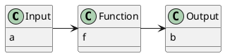
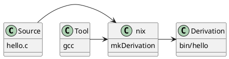

# The core idea

Building software can be a pure function

Brings reproducibility

---

# On pure functions

* Reproducible
* Input => Output
* No side effects
* No randomness
* Easy to test
* Eeasy to reason about
* Can be composed

---

# Builds as a pure function

